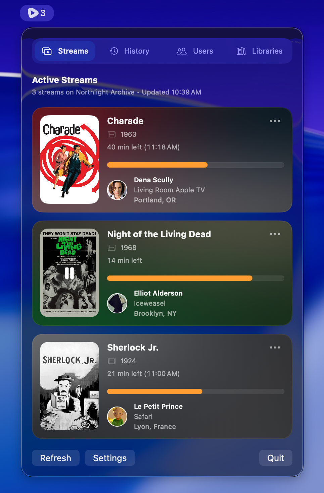
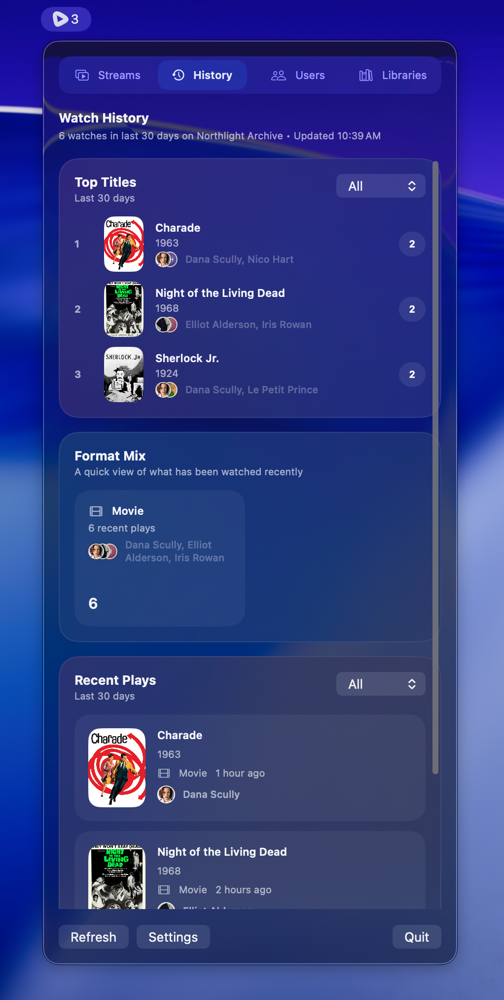

<h1 align="center">
  
  <br><span style="font-family: monospace;">PlexBar</span>
</h1>

PlexBar is a lightweight macOS menu bar app for Plex server telemetry.

<p align="center">
  
  
</p>

## Features

- Native macOS menu bar app
- Plex sign-in and server discovery
- Live view of active sessions with playback details

## Requirements

- macOS 26+

## Build, Run, and Package

Copy `.env.example` to `.env.local` and update values as necessary.

To build and run the app:

```bash
script/build_and_run.sh
```

To run with mock data:

```bash
script/build_and_run.sh --mock
```

To package the app as a `dmg`:

```bash
script/build_dmg.sh
```
